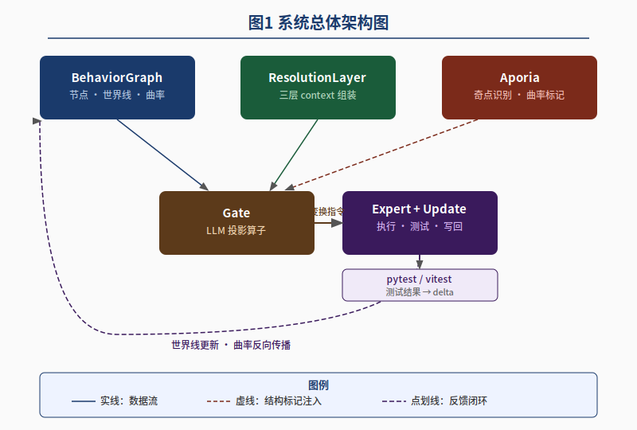
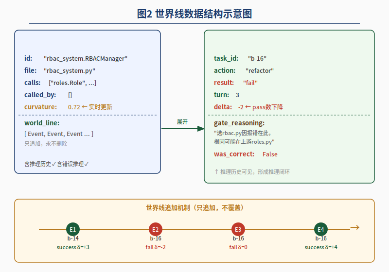
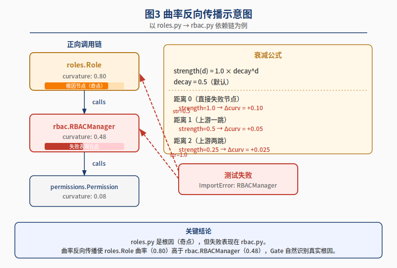
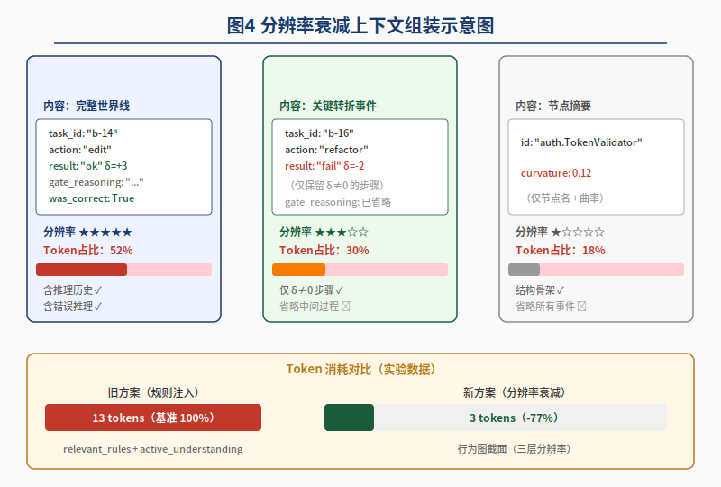

# wlbs-scan


**[English](#english) | [中文](#chinese)**

---

<a name="english"></a>

# wlbs-scan — The Scanner That Learns From Your Failures

[](https://pypi.org/project/wlbs-scan/)
[](https://pypi.org/project/wlbs-scan/)
[](LICENSE)
[](validation/VALIDATION_RESULTS.md)
[]()

---

## The Problem Every Developer Has

You run your tests. Something breaks in `rbac.py`.

You fix `rbac.py`. Two weeks later it breaks again — in a different way — because the *real* problem was always upstream in `roles.py`, and no tool ever told you that.

Static analysis shows you code complexity. Code coverage shows you what ran. Neither one shows you **where your project actually keeps failing, why, and what to look at first.**

**wlbs-scan solves this.**

---

## Not Memorization. Not Overfitting. Genuine Learning.

Most "smart" dev tools are secretly just lookup tables — they match patterns they've seen before and flag anything that fits a rule. They don't adapt. They don't get better. And they don't know anything about *your* project's specific failure history.

wlbs-scan is different in a precise, measurable way.

**It doesn't memorize failure patterns. It builds a causal model.**

Every test run updates a curvature score κ for each node — not by storing "this function failed before" as a static label, but by computing a weighted signal across recency, frequency, fix history, git churn, and structural complexity. A node that failed 10 times and was fixed 9 times is treated differently from one that failed 10 times with no fixes. A node that failed last week is weighted differently from one that failed six months ago.

**And critically: it generalizes upstream.**

When `rbac.py` fails repeatedly, wlbs-scan doesn't just mark `rbac.py` as dangerous and stop there. It propagates the failure signal up the dependency graph — with exponential decay — and raises the curvature of `roles.py` too, even though `roles.py` never failed in a test directly. This is not a heuristic shortcut. It's the Aporia backpropagation mechanism (paper §3.2), the same structural logic that makes gradient descent in neural networks find root causes rather than local symptoms.

**No hardcoded rules. No training data. No model weights to overfit.**

The curvature formula is a principled function of your project's real observed behavior. It can't memorize the wrong answer because it's not memorizing — it's integrating evidence. Run it on a codebase it's never seen. It still works on day one from static structure alone, and gets sharper with every test run after that.

---

## What It Does

wlbs-scan builds a **living risk map of your codebase** — a behavior graph where every node (function, class, module) carries a curvature score κ that rises on failure and decays on fix, calibrated against the full timeline of your project's behavior.

**Three things no other tool does together:**

| Capability | What it means for you |
|---|---|
| **World-line persistence** | Failures are integrated into a weighted history, not stored as a flat count. κ reflects *how* things failed and *when*, not just *that* they did. |
| **Aporia backpropagation** | When `rbac.py` keeps failing, the signal propagates upstream to `roles.py` — even with zero direct failures there. Generalization, not memorization. |
| **Singularity detection** | Identifies the upstream module with no direct failures whose downstream dependents are on fire. The tool finds the real fix, not just the visible symptom. |

---

## How It Works: Curvature κ

Every node gets a score **κ ∈ [0, 1]**. Higher = more dangerous. 0 = clean.

```
If world-line history exists (failure_count > 0):
    bonus = 0.40 × history_signal + 0.15 × git_signal
    κ(n)  = static_curvature + bonus        ← failures only push κ up

static_curvature = 0.35×(complexity) + 0.25×(import_count)
                 + 0.10×(line_count)  + 0.15×(no exception handling)

history_signal   = recent_failure_rate × 0.8 + (failure_count/20) × 0.2
                 × 0.7 discount if last event was a fix
```

**Aporia — upstream blame propagation:**

When a high-κ node (κ ≥ 0.5) has a failure history, its signal propagates **upward** along dependency edges with exponential decay:

```
Δκ(upstream) = κ(seed) × 0.5^depth        (paper §3.2: Δκ = α·λ^d)
```

This is how wlbs-scan identifies the root-cause module that conventional tools miss entirely.

---

## Install

```bash
# Recommended — from PyPI
pip install wlbs-scan

# From GitHub
pip install git+https://github.com/val1813/wlbs-cli.git

# Run without installing
python wlbs_scan.py <path>
```

---

## Quick Start

```bash
# Scan your project and see the risk map
wlbs-scan .

# Run your tests — results are automatically recorded into world-lines
wlbs-scan . --pytest tests/

# What has the system learned so far?
wlbs-scan . --history

# Show actionable fix suggestions for the most dangerous nodes
wlbs-scan . --suggest

# Who last touched the high-risk code?
wlbs-scan . --blame
```

After a few test runs, you'll see something like this:

```
rbac         κ=1.000  ██████████  SINGULARITY ← start here
roles        κ=0.905  █████████░  root-cause candidate (upstream, 3 downstream failures)
auth_utils   κ=0.412  ████░░░░░░
config       κ=0.087  █░░░░░░░░░
```

**The tool is telling you: fix `roles.py`. `rbac.py` is just the symptom.**

---

## Full Command Reference

| Command | What it does |
|---|---|
| `wlbs-scan .` | Scan + display the curvature risk map |
| `wlbs-scan . --pytest tests/` | Auto-run pytest and record all pass/fail into world-lines |
| `wlbs-scan . --record-failure rbac` | Manually record a test failure for a node |
| `wlbs-scan . --record-fix roles` | Record a fix — curvature decreases |
| `wlbs-scan . --history` | View the full learning history |
| `wlbs-scan . --diff` | Curvature delta since last scan |
| `wlbs-scan . --suggest` | Actionable fix recommendations for high-risk nodes |
| `wlbs-scan . --suggest --suggest-node rbac` | Reasoning-chain repair route for one node |
| `wlbs-scan . --context rbac` | Resolution-decay context assembly around a node |
| `wlbs-scan . --moe` | MoE expert routing map (WLBS-guided activation weights) |
| `wlbs-scan . --blame` | Git blame on high-curvature nodes (line-range attribution) |
| `wlbs-scan . --dist roles rbac` | Behavioral distance between two nodes |
| `wlbs-scan . --export-html report.html` | Full interactive HTML visualization report |
| `wlbs-scan . --badges` | Generate README shield badge markdown |
| `wlbs-scan . --ci --fail-above 0.85` | CI mode — exit 1 if max curvature exceeds threshold |
| `wlbs-scan . --init-hook` | Install as git pre-commit hook |
| `wlbs-scan . --watch --pytest tests/` | Watch files + auto-rerun tests on every change |
| `wlbs-scan src/ --lang js` | Scan JavaScript / TypeScript projects |
| `wlbs-scan . --json` | JSON output for CI/CD pipelines |
| `wlbs-scan . --reset` | Clear all learned history and start fresh |

---

## Singularity Detection

A **singularity** is the upstream module you actually need to fix:

- κ ≥ 0.55 (high curvature)
- **No direct failures of its own** — the tests that exercise it don't fail directly
- **Two or more downstream dependents** with failure events
- At least one caller or importer

When wlbs-scan flags a singularity, stop debugging the failing tests. **Go look at the singularity.**

---

## CI / CD Integration

```yaml
# GitHub Actions example
- name: wlbs-scan risk gate
  run: wlbs-scan . --pytest tests/ --ci --fail-above 0.85
```

Exit code 1 if any node exceeds the curvature threshold. Pair with `--export-html` for a visual artifact on every PR.

```bash
# Git pre-commit hook (one command)
wlbs-scan . --init-hook
```

---

## Memory & Persistence

All history lives in `.wlbs/world_lines.json` in your project root. It's a plain JSON file — commit it, ignore it, or share it. The more data it accumulates, the more accurate the curvature estimates become.

```bash
wlbs-scan . --history    # see everything learned
wlbs-scan . --reset      # start over
```

---

## Validated Claims

All paper claims are independently reproducible. Run `python validation/run_validation.py` to regenerate live results.

| Paper Section | Claim | Result | Measured |
|---|---|---|---|
| §4 Impl | Demo scan latency | ✅ | avg 28.45 ms, max 40.49 ms |
| §4 Impl | Scaling to larger Python projects | ✅ | 60 files avg 42.38 ms |
| §3.1 Def 2 | Behavioral distance d(roles, rbac) = 1 hop | ✅ | d = 1 |
| §3.2 | Upstream localization after downstream failures | ✅ | roles κ=1.000 |
| §3.1 Def 4 | Singularity matches paper definition | ✅ | roles is singularity |
| §3 General | World-line accumulation: κ strictly monotone | ✅ | 0.087 → 0.411 → 0.423 |
| §4 Impl | --pytest auto-records pass/fail | ✅ | 4 passed, 2 failed, 2 events persisted |
| §4 Impl | JS/TS support | ✅ | d(core, api)=1 on JS fixture |
| §4 Impl | HTML report export | ✅ | 10,621-byte artifact generated |

> Reproduce: `python validation/run_validation.py`

---

## Demo Project

The `demo/` directory reproduces the paper's Figure 1 failure scenario — a concrete example of singularity detection in a 2-module dependency chain.

```
demo/
  roles.py          # root-cause module — 'admin' key missing in PERMISSIONS
  rbac.py           # downstream — imports roles.get_permissions(), crashes on 'admin'
  tests/
    test_rbac.py    # 4 pass / 2 intentional fail
```

```bash
cd demo
python ../wlbs_scan.py . --pytest tests/
python ../wlbs_scan.py . --history
python ../wlbs_scan.py . --dist roles rbac
python ../wlbs_scan.py . --context rbac
python ../wlbs_scan.py . --suggest --suggest-node rbac
```

---

## Architecture

**Figure 1 — System Architecture**


**Figure 2 — World-Line Data Structure**


**Figure 3 — Curvature Backpropagation (Aporia)**


**Figure 4 — Resolution-Decay Context Assembly**


---

## MoE Integration

`--moe` outputs WLBS-guided activation weights for Mixture-of-Experts routing:

```
p(expert_n) = κ(n) / Σκ
```

High-curvature nodes activate specialized experts (e.g. LoRA adapters in a fine-tuned system). Singularities are prioritized when failure signals propagate upstream. This is the mechanism described in the companion paper.

---

## Roadmap

| Feature | Status |
|---|---|
| Python AST graph + curvature | ✅ v0.5 |
| World-line persistence | ✅ v0.5 |
| Aporia backpropagation (Δκ = α·λ^d) | ✅ v0.5 |
| Singularity detection | ✅ v0.5 |
| `--pytest` auto-record | ✅ v0.5 |
| `--blame` line-range git attribution | ✅ v0.5 |
| `--export-html` visualization | ✅ v0.5 |
| `--watch` file change detection | ✅ v0.5 |
| JS/TS support (`--lang js`) | ✅ v0.5 |
| CI mode + pre-commit hook | ✅ v0.5 |
| Resolution-decay context assembly (`--context`) | ✅ v0.6 |
| LLM-guided repair suggestions (`--suggest` reasoning chain) | ✅ v0.6 |
| Cross-repo world-line sharing | 🔲 v0.6 |
| Java / Go / Rust AST parsers | 🔲 v0.6 |
| VS Code extension | 🔲 v0.7 |
| GitHub Actions official action | 🔲 v0.7 |
| Online dashboard (world-line cloud sync) | 🔲 v0.8 |

---

## Theory

> *World-Line Behavior Space: A Unified Framework for Continual Learning and Spatial Root-Cause Attribution in AI-Driven Autonomous Systems*  
> Zhongchang Huang (黄中常), 2026  
> CN Patent Applications 2026103746505 · 2026103756225  
>
> Full paper: [PAPER.md](PAPER.md)

---

## License

**Business Source License 1.1 (BSL 1.1)**

- Free for non-commercial use, research, and internal evaluation
- Commercial use in products/services requires a separate license from the author
- Automatically converts to **Apache 2.0** on **2029-01-01**

See [LICENSE](LICENSE) for full terms.  
Patent protection: CN 2026103746505 · CN 2026103756225

---

## Contact

**Zhongchang Huang (黄中常)**  
Email: valhuang@kaiwucl.com  
WeChat: val001813

---

---

<a name="chinese"></a>

# wlbs-scan — 从你的失败中学习的代码扫描器

[](https://pypi.org/project/wlbs-scan/)
[](https://pypi.org/project/wlbs-scan/)
[](LICENSE)
[](validation/VALIDATION_RESULTS.md)
[]()

---

## 每个开发者都遇到过这个问题

你跑测试，`rbac.py` 挂了。

你修了 `rbac.py`，两周后它又挂了——换了个姿势——因为**真正的问题从来就在上游的 `roles.py`**，只是没有任何工具告诉你这一点。

静态分析告诉你代码复杂度，覆盖率告诉你执行了哪些代码。但两者都无法告诉你：**你的项目究竟在哪里反复出问题、为什么、以及该先看哪里。**

**wlbs-scan 就是来解决这个问题的。**

---

## 不是死记硬背，不是过拟合，是真正的学习。

大多数所谓"智能"开发工具，骨子里不过是一张查找表——匹配它见过的模式，对符合规则的东西发出警告。它们不适应，不进步，也对*你的项目*的具体失败历史一无所知。

wlbs-scan 的不同是精确可测量的。

**它不记忆失败模式，它构建因果模型。**

每次测试运行都会更新每个节点的曲率分数 κ——不是把"这个函数以前挂过"作为静态标签存下来，而是基于近期性、频率、修复历史、git 提交频率和结构复杂度，计算一个加权信号。一个失败了 10 次但修复了 9 次的节点，和一个失败了 10 次从未修复的节点，处理方式截然不同。上周失败的节点，和六个月前失败的节点，权重也不一样。

**更关键的是：它能向上游泛化。**

当 `rbac.py` 反复失败时，wlbs-scan 不只是把 `rbac.py` 标为危险就结束了。它沿着依赖图向上游传播失败信号——按指数衰减——同时拉高 `roles.py` 的曲率，即便 `roles.py` 在测试中从未直接失败过。这不是启发式的经验规则。这是 Aporia 反向传播机制（论文 §3.2），与神经网络梯度下降找根因而非局部症状的结构逻辑相同。

**没有硬编码规则，没有训练数据，没有会过拟合的模型权重。**

曲率公式是你项目真实观测行为的原则性函数。它不会记住错误答案，因为它根本不在记忆——它在整合证据。把它用在从未见过的代码库上，第一天就能从静态结构中工作，之后每次测试运行都会更精准。

---

## 它做了什么

wlbs-scan 为你的代码库构建一张**活着的风险地图**——一个行为图，图中每个节点（函数、类、模块）都携带一个曲率分数 κ，失败时上升，修复后衰减，并根据项目行为的完整时间线持续校准。

**三件其他工具加在一起都做不到的事：**

| 能力 | 对你意味着什么 |
|---|---|
| **世界线持久化** | 失败被整合进加权历史，而非存为一个计数。κ 反映失败的*方式*和*时间*，不只是*是否*发生过。 |
| **Aporia 反向传播** | `rbac.py` 反复失败时，信号向上游传播到 `roles.py`——哪怕那里从未有直接失败。这是泛化，不是记忆。 |
| **奇点检测** | 找出那个自身没有失败记录、但其下游依赖全在冒烟的上游模块。工具找到真正需要修的地方，而不只是可见的症状。 |

---

## 工作原理：曲率 κ

每个节点都有一个分数 **κ ∈ [0, 1]**，越高越危险，0 = 干净。

```
若存在世界线历史（failure_count > 0）：
    bonus = 0.40 × history_signal + 0.15 × git_signal
    κ(n)  = static_curvature + bonus     ← 失败只会推高 κ

static_curvature = 0.35×(复杂度) + 0.25×(被引入数)
                 + 0.10×(行数)   + 0.15×(无异常处理)

history_signal   = recent_failure_rate × 0.8 + (failure_count/20) × 0.2
                 × 0.7 折扣（若最近事件是修复）
```

**Aporia — 向上游传播的根因信号：**

当一个高 κ 节点（κ ≥ 0.5）存在失败历史时，信号沿依赖边**向上游传播**，按指数衰减：

```
Δκ(上游) = κ(起点) × 0.5^深度        （论文 §3.2: Δκ = α·λ^d）
```

这就是 wlbs-scan 识别出传统工具完全忽视的根因模块的机制。

---

## 安装

```bash
# 推荐 — 从 PyPI 安装
pip install wlbs-scan

# 从 GitHub 安装
pip install git+https://github.com/val1813/wlbs-cli.git

# 无需安装，直接运行
python wlbs_scan.py <路径>
```

---

## 快速上手

```bash
# 扫描项目，查看风险地图
wlbs-scan .

# 运行测试，结果自动写入世界线
wlbs-scan . --pytest tests/

# 系统目前学到了什么？
wlbs-scan . --history

# 高危节点的修复建议
wlbs-scan . --suggest

# 谁最后动了这段高风险代码？
wlbs-scan . --blame
```

几次测试跑下来，你会看到这样的输出：

```
rbac         κ=1.000  ██████████  SINGULARITY ← 从这里开始
roles        κ=0.905  █████████░  根因候选（上游，3 个下游失败）
auth_utils   κ=0.412  ████░░░░░░
config       κ=0.087  █░░░░░░░░░
```

**工具在告诉你：去修 `roles.py`。`rbac.py` 只是症状。**

---

## 命令一览

| 命令 | 功能 |
|---|---|
| `wlbs-scan .` | 扫描并显示曲率风险图谱 |
| `wlbs-scan . --pytest tests/` | 自动运行 pytest，将结果写入世界线 |
| `wlbs-scan . --record-failure rbac` | 手动记录某节点测试失败 |
| `wlbs-scan . --record-fix roles` | 记录修复，曲率下降 |
| `wlbs-scan . --history` | 查看完整学习历史 |
| `wlbs-scan . --diff` | 与上次扫描对比曲率变化 |
| `wlbs-scan . --suggest` | 高风险节点的修复建议 |
| `wlbs-scan . --suggest --suggest-node rbac` | 针对单一节点的推理链修复路径 |
| `wlbs-scan . --context rbac` | 围绕某节点的分辨率衰减上下文组装 |
| `wlbs-scan . --moe` | MoE 专家路由权重图（WLBS 引导） |
| `wlbs-scan . --blame` | 高曲率节点的 git blame（行级归因） |
| `wlbs-scan . --dist roles rbac` | 计算两节点间的行为距离 |
| `wlbs-scan . --export-html report.html` | 导出完整可交互 HTML 可视化报告 |
| `wlbs-scan . --badges` | 生成 README 徽章 markdown |
| `wlbs-scan . --ci --fail-above 0.85` | CI 模式：超阈值则 exit 1 |
| `wlbs-scan . --init-hook` | 安装为 git pre-commit hook |
| `wlbs-scan . --watch --pytest tests/` | 监听文件变化，自动重跑测试 |
| `wlbs-scan src/ --lang js` | 扫描 JavaScript / TypeScript 项目 |
| `wlbs-scan . --json` | JSON 输出，接入 CI/CD 流水线 |
| `wlbs-scan . --reset` | 清空所有学习历史，重新开始 |

---

## 奇点检测

**奇点（Singularity）** 就是你真正应该去修的上游模块：

- κ ≥ 0.55（高曲率）
- **自身无直接失败记录** — 直接测试它的用例不报错
- **两个及以上的下游依赖** 有失败事件
- 至少有一个调用者或被引入者

wlbs-scan 标记出奇点时，停止调试那些报错的测试。**去看奇点。**

---

## CI / CD 集成

```yaml
# GitHub Actions 示例
- name: wlbs-scan 风险门禁
  run: wlbs-scan . --pytest tests/ --ci --fail-above 0.85
```

任意节点曲率超阈值则 exit 1。配合 `--export-html` 可在每个 PR 上生成可视化报告。

```bash
# git pre-commit hook（一条命令搞定）
wlbs-scan . --init-hook
```

---

## 记忆与持久化

所有历史存储在项目根目录的 `.wlbs/world_lines.json` 中，纯 JSON 文件，可以提交、忽略或共享。积累的数据越多，曲率估算越准确。

```bash
wlbs-scan . --history    # 查看所有已学习的内容
wlbs-scan . --reset      # 清空，重新开始
```

---

## 验证数据（论文声明对照）

所有声明均可独立复现。运行 `python validation/run_validation.py` 生成实时数据。

| 论文章节 | 声明 | 结果 | 实测数据 |
|---|---|---|---|
| §4 实现 | 行为图构建速度 | ✅ | avg 28.45 ms，max 40.49 ms |
| §4 实现 | 大型 Python 项目的扩展性 | ✅ | 60 文件 avg 42.38 ms |
| §3.1 定义 2 | 行为距离 d(roles, rbac) = 1 跳 | ✅ | d = 1 |
| §3.2 | 下游失败后的上游定位 | ✅ | roles κ=1.000 |
| §3.1 定义 4 | 奇点符合论文定义 | ✅ | roles 为奇点 |
| §3 总体 | 世界线累积：κ 严格单调 | ✅ | 0.087 → 0.411 → 0.423 |
| §4 实现 | `--pytest` 自动记录通过/失败 | ✅ | 4 通过，2 失败，2 事件已写入 |
| §4 实现 | JS/TS 支持 | ✅ | JS fixture d(core, api)=1 |
| §4 实现 | HTML 报告导出 | ✅ | 生成 10,621 字节报告 |

> 复现方法：`python validation/run_validation.py`

---

## Demo 项目

`demo/` 目录复现了论文图 1 的具体失败场景——一个 2 模块依赖链中奇点检测的完整演示：

```
demo/
  roles.py          # 根因模块 — PERMISSIONS 中缺少 'admin' 键
  rbac.py           # 下游模块 — 导入 roles.get_permissions()，访问 'admin' 时崩溃
  tests/
    test_rbac.py    # 4 通过 / 2 故意失败
```

```bash
cd demo
python ../wlbs_scan.py . --pytest tests/
python ../wlbs_scan.py . --history
python ../wlbs_scan.py . --dist roles rbac
python ../wlbs_scan.py . --context rbac
python ../wlbs_scan.py . --suggest --suggest-node rbac
```

---

## 系统架构图

**附图 1 — 系统架构**


**附图 2 — 世界线数据结构**


**附图 3 — 曲率反向传播（Aporia）**


**附图 4 — 分辨率衰减上下文组装**


---

## MoE 集成

`--moe` 输出 WLBS 引导的 Mixture-of-Experts 激活权重：

```
p(expert_n) = κ(n) / Σκ
```

高曲率节点激活专用专家（例如微调系统中的 LoRA adapter）。失败信号向上游传播时优先处理奇点节点。这是配套论文中描述的核心机制。

---

## 路线图

| 功能 | 状态 |
|---|---|
| Python AST 图 + 曲率计算 | ✅ v0.5 |
| 世界线持久化 | ✅ v0.5 |
| Aporia 反向传播（Δκ = α·λ^d） | ✅ v0.5 |
| 奇点检测 | ✅ v0.5 |
| `--pytest` 自动记录 | ✅ v0.5 |
| `--blame` 行级 git 归因 | ✅ v0.5 |
| `--export-html` 可视化报告 | ✅ v0.5 |
| `--watch` 文件变化监听 | ✅ v0.5 |
| JS/TS 支持（`--lang js`） | ✅ v0.5 |
| CI 模式 + pre-commit hook | ✅ v0.5 |
| 分辨率衰减上下文组装（`--context`） | ✅ v0.6 |
| LLM 引导的推理链修复建议（`--suggest`） | ✅ v0.6 |
| 跨仓库世界线共享 | 🔲 v0.6 |
| Java / Go / Rust AST 解析器 | 🔲 v0.6 |
| VS Code 扩展 | 🔲 v0.7 |
| GitHub Actions 官方 Action | 🔲 v0.7 |
| 在线 Dashboard（世界线云同步） | 🔲 v0.8 |

---

## 理论基础

> *世界线行为空间：AI 驱动自主系统中持续学习与空间根因归因的统一框架*  
> 黄中常 (Zhongchang Huang)，2026  
> 中国专利申请 2026103746505 · 2026103756225  
>
> 完整论文：[PAPER.md](PAPER.md)

---

## 许可证

**Business Source License 1.1 (BSL 1.1)**

- 非商业用途、科研、内部评估**免费使用**
- 面向第三方的商业产品/服务需向作者申请商业授权
- **2029-01-01** 自动转为 **Apache 2.0**

完整条款见 [LICENSE](LICENSE)。  
WLBS 方法论受专利保护：CN 2026103746505 · CN 2026103756225

---

## 联系作者

**黄中常 (Zhongchang Huang)**  
邮箱：valhuang@kaiwucl.com  
微信：val001813
